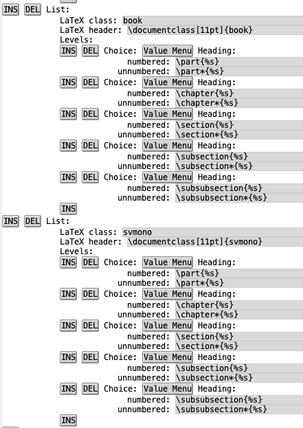

* Book template in org-mode that uses the svmono class (version:  0.1.4 )

** What is this for?

Many academic scientists and engineers maintain notebooks of information in LaTeX documents.
They want to capture their insights and new knowledge in a place organized in a hierarchy.
They would like to be able to retrieve that information quickly via the autogenerated table of contents, lists, index, and a PDF of their book document.
They use their notebook in the same way others use personal wikis or zettelkasten to store and retrieve knowledge.

Furthermore, they might have the vain hope of publishing this book someday, but most notebooks are used only for self-study.
Once the skeleton of the book document has been assembled, its style can be easily modified by changing the class to meet the specific needs of a publisher.
Usually, these notebooks require a great deal of time and energy to rewrite their prose to be suitable for publication.
Usually, the incentive for doing so is too weak compared to other pressures and priorities.
Very often, assembling the material is the limit of the self-study.
This is sufficient for the moment's needs, such as mastering a new skill to be deployed in a new project.

*** Template for a dissertation
You could use this Org-Mode book as a template to assemble a dissertation.
Many universities require you to use a specific LaTeX class because they want a uniform style across all dissertations assembled with LaTeX. 
You can adapt this template by changing document classes in the preamble of the `main.org` file.
It will likely take considerable pressure from below to persuade them to add support for Org-mode.
Part of the problem is that few librarians know how to use LaTeX, let alone org-mode.
Just change the class name in the Preamble drawer and follow the directions below to add a new class to the available LaTeX classes in the variable ~org-latex-classes~.

** Why Org-mode?
Org-mode provides excellent support for assembling tables.
There is no peer competitor for the incredible flexibility in assembling tables.
The tables self-adjust by hitting *tab* as you add new columns and rows.
You can do math on columns and rows.
Tables in org-mode are like mini Excel spreadsheets.

Another key feature of Org-Mode is its support for literate programming.
You can turn your code blocks into executable code that generates plots.
This is useful in projects where there is a need to update tables and figures as new data are collected.
This is particularly useful for graduate students who are wise enough to start assembling their dissertation while still collecting the data.

Many Org-mode users are uncomfortable using LaTeX because they have not taken the time to master LaTeX.
Some of them think it is an archaic type-setting system without realizing its potency.
LaTeX may not follow the latest fads in software engineering, but it has solutions for almost every edge case.
Org-mode provides a means of hiding LaTeX from users who are intimidated by it.

** Features
- Use of multiple documents, with each chapter in a separate document.
- Autogenerated table of contents.
- Autogenerated bibliography.
- Autogenerated acronym list.
- Autogenerated list of code listings.
- Autogenerated list of tables.
- Autogenerated list of figures.
- Autogenerated subject index and author index.
- Indices with hyperlinks to sites in the document.
- Narrow margins to avoid wasting paper.

** Quick start
- Clone this repository to your software directory.
- Copy the folder to a new directory (~cp -R~) when you want to start a new writing project.
- The writing project has the *main.org* at the top level. It imports the chapters.org files from the *Contents* subfolder.
- The chapters import image files from the ~./Contents/figs~ subfolder.
- Load the *main.org* into Emacs and customize. Change the title, author, and path to your Bibtex bibliography file.
- The *main.org* calls the chapters from the Contents subfolder. Add new chapters to the Contents subfolder and include them via the include command in *main.org*.
- The images are stored in ~./Contents/figs/~.
- The code listings are stored in ~./Contents/codeListings/~. You can paste code into a lstlisting code block rather than import the code with an include statement.
- Each appendix file has the same format as a chapter. They are enumerated by letters instead of numbers.
- Compile the book by entering ~C-c C-e l o~. It takes several seconds to compile to PDF in org-mode. You may need to repeat to build the bibliography the first time.

** Emacs init.el configuration

The following elisp code will run the required LaTeX programs when you enter ~C-c C-e l o~.
Add it to your Emacs initialization file.
If you want to use pdflatex instead of lualatex, edit accordingly.
*pdflatex* works with this template.
*Lualatex* may work better when using the minted package for code listings.

#+begin_src elisp
(with-eval-after-load 'ox-latex
  (setq org-latex-pdf-process
        '("lualatex -interaction nonstopmode --shell-escape -synctex=1 -output-directory %o %f"
          "bibtex %b"
          "makeindex -s %b.ist -o %b.ind %b.idx"
          "makeindex -s %b.ist -o %b.and %b.ain"
          "makeglossaries %b"
          "lualatex -interaction nonstopmode --shell-escape -synctex=1 -output-directory %o %f"
          "lualatex -interaction nonstopmode --shell-escape -synctex=1 -output-directory %o %f")))
#+end_src

The book has a subject index and an author index.
The imakeidx package eases the creation of two indices when using citar or org-cite for bibliographic management.
The subject index keys are in the form of \index[main]{<keyword>}.
The author index keys are in the form of \index[main]{<Last name, first name>}.

To significantly ease the addition of both types of cite keys, I recommend adding these functions and keybindings to your init file.el file.
You enter the keybinding by positioning the cursor where you want the key to be added.
You will be prompted in the minibuffer for the keyword or author name.
These functions make creating index keys enjoyable!

#+begin_src elisp
;;; works imakeidx package in org-mode. Could work in Autex too.
(defun ml/insert-main-index-entry ()
  "Insert a general index entry"
  (interactive)
  (let ((term (read-string "Index term: ")))
    (insert "\\index[main]{" term "}")))

(defun ml/insert-author-index-entry ()
  "Insert an author index entry"
  (interactive)
  (let ((author (read-string "Author (Last, First): ")))
    (insert "\\index[authors]{" author "}")))

(eval-after-load 'org-mode
      '(define-key org-mode-map (kbd "C-c w a") 'insert-author-index-entry))
(eval-after-load 'org-mode
        '(define-key org-mode-map (kbd "C-c w m") 'insert-main-index-entry))

(eval-after-load 'tex-mode
      '(define-key Latex-mode-map (kbd "C-c w a") 'insert-author-index-entry))
(eval-after-load 'tex-mode
       '(define-key Latex-mode-map (kbd "C-c w m") 'insert-main-index-entry))
#+end_src

You can use LaTeX citekeys in org-mode.
In such a case, it is possible to automate the generation of author keys using the authorindex package.
Every time you enter a new citekey, the author index will be updated.
This is a very nice approach.
You will need to map the \cite macro to the \aicite macro to automate the process.
Unfortunately, the authorindex package does not work with citar or org-cite style citekeys.
This is the first limitation I have encountered while using Org-Mode to create a book.
Comment out the author index in the main.org file if you do not want it generated.

** Bash function to ease starting a book project

I use the following bash function to make it easy to start a new book project.
You can store the bash function in your .bashrc or .zshrc file.

I enter ~bookorg <name of book in PascalCase>~.
The name of the book becomes the folder name.
I cannot remember if the function name is *orgbook* or *bookorg*, so I provided both versions of the function.

#+begin_src bash
function bookorg {
echo "Copy book template directory in org-mode with project name as the new folder name."
if [ $# -lt 1 ]; then
  echo 1>&2 "$0: not enough arguments"
  echo "Usage1: bookorg <ProjectDirectory>"
  return 2
elif [ $# -gt 1 ]; then
  echo 1>&2 "$0: too many arguments"
  echo "Usage1: bookorg <ProjectDirectory>"
  return 2
fi
projectID="$1"
cp -R  ~/6112MooersLabGitHubLabRepos/bookInOrg ~/$1
}

function orgbook {
echo "Copy book template directory in org-mode with project name as the new folder name."
if [ $# -lt 1 ]; then
  echo 1>&2 "$0: not enough arguments"
  echo "Usage1: orgbook <ProjectDirectory>"
  return 2
elif [ $# -gt 1 ]; then
  echo 1>&2 "$0: too many arguments"
  echo "Usage1: orgbook <ProjectDirectory>"
  return 2
fi
projectID="$1"
cp -R  ~/6112MooersLabGitHubLabRepos/bookInOrg ~/$1
}
#+end_src

You should start a writing log for the book project.
Visit the writing log repositories at MooersLab on GitHub.

** Use treemacs to ease working with multiple files

I create workspaces inside *treemacs*.
The *treemacs* package provides a side panel buffer that displays the book project's files.
This side panel eases the opening and creation of new files.

** Keep book project under version control

I use what I call `push functions` to ease committing updates to documents.
I store each writing project in a dedicated GitHub repo.
I copy the updated files to a separate folder that contains all of the local copies of my GitHub repos.
I then push the changes.
The push function handles all of these steps by entering the function name.
A commit message is an optional argument.

The code listing below is a yasnippet for creating two push functions: one for the book and one for the log file.
The '----' represents the name of the writing project.
The number is a four-digit project number stored in a project database file.
The number and name make up the project folder name in my home directory.
The snippet accelerates the creation of the push functions with three mirrored tab stops.
It ensures complete and accurate customization of the template.

#+begin_src bash
# -*- mode: snippet -*-
# name: push-book-writing-project
# key: pbook
# --

function pbook${1:2104} () {
    echo "Pulls from Overleaf and copies to BlaineMooersLab on GitHub."
    cd ~/2104emacs/ov
    git pull
    cd     
    cd ~/6114BlaineMooersLabGitHubRepos/${1}${2:----}/Content
    cp ~/${1}${2}/Content/*.org .
    cp ~/${1}${2}/Content/figs/*.* ./Figures/.
    cd ..
    comment="${3:-Updated}"  
    gac ./Content "$comment"  
    git push  
    echo "Pushed book ${1}${2}."  
    cd ~/
    pwd   
}

function plog${1} () {
    cd ~/6114BlaineMooersLabGitHubRepos/${1}${2}/Content/writingLog
    if [ -f /Users/blaine/2104${2}/ov/writingLog/log${1}.org ]; then
        cp /Users/blaine/2104${2}/ov/writingLog/log${1}.org .
        file_to_commit="log${1}.org"
    else  
        cp /Users/blaine/${1}${2}/ov/writingLog/${1}.tex .
        file_to_commit="log${1}.tex"
    fi
    comment="${3:-Updated}"
    gac "$file_to_commit" "$comment"      
    git push
    echo "Pushed the log file for project ${1}${2:----}." 
    cd ~/
    pwd
}
#+end_src

** Why not use the default book class in org-mode?

I found that the default book template had too many limitations.
The *svmono* class best met my needs. 
It is the class used by the publisher Springer.
You must add the *svmono* class to the variable *org-latex-classes* after entering *M-x customize*.
See the image below for guidance.
This step will take five minutes.

** Needs that are met by this template

I needed to scroll through the book's PDF quickly.
Many other file formats scroll badly once they reach a certain length.
Even an org document can be problematic when it has hundreds of headlines.
I would never try to assemble a book from a single org file.

Instead, I use a central main.org to include individual chapters in separate document files.
This modular approach can isolate problematic chapters by commenting them out in the master *main.org* document.
This allows you to proceed with compiling the document until you have time to address the issues in that problematic file.
The PDF and plain text files do not have those issues.

Finding a good template for generating such a book was a chore ten years ago.
It took me days to develop a book template in LaTeX.
I have used the LaTeX template over 100 times to start book projects on Overleaf.

I wanted a book style that allowed for narrow margins to minimize paper consumption.
I needed a book with auto-generated tables of contents, indices of terms, and indices of authors.
I also wanted a book that would support the generation of lists of figures, tables, equations, and code listings.
Likewise, I wanted to generate glossaries of acronyms, symbols, and terms.
Unfortunately, computer memory limits how many kinds of lists and indices you can use simultaneously in a single book document.
You may have to select a subset.

*** Porting book template to Org-mode
I have ported my favorite LaTeX book template to org-mode because many org users are uncomfortable using pure LaTeX.
This template depends upon the *svmono.cls*.
It took me about a day to discover that I needed to customize the 'org-latex-classes' variable by adding 'svmono' as a class.
After I had completed this operation, the PDF would be compiled correctly with narrow margins and indices.
The image below shows a snapshot of the customization menu.
The top entry is for one of the default formats, which are article, book, and report.
The bottom entry shows the one for *svmono*.

*** Multidocument approach
My Approach is to use a *0AAAmain.org* file as the central node of the book. 
It includes statements to import individual chapters and appendices, which are also chapters but enumerated with letters.
The chapters and appendices are stored in a *Contents* subfolder.
They are named *Chwhatever.org*.

If the chapters are grouped into parts, I may indicate membership of a part by using a number in front of `Ch'.
I do this when there are 20 or more chapters.

The images are stored in a *figs* sub-sub folder.
The code listings are stored in a subsubfolder named *codeListings*. 

The file *0AAAmain.org* is analogous to *main.tex* in LaTeX multiple-part documents.
This filename appears near the top of the list of files in a directory.
This eases the rediscovery of this master file.
You will have to edit this file as you add more chapters.

*** LaTeX 
Once I started thinking of Org-mode as a thin wrapper around LaTeX, this revelation enhanced my willingness to dive into Org-mode.
It's easy enough for me to retreat to \LaTeX if things go wrong.
Org-mode will generate a TeX file while exporting the org-mode project to a PDF.
However, this TeX file often will have a lot of extra boilerplate.

I store the LaTeX preamble of almost 200 lines inside a drawer.
This preamble imports LaTeX packages and contains the settings that format the document.
You typically do not need to adjust these settings, so keep them out of sight and out of mind.
You also do not want to copy or paste anything into this area inadvertently.

*** Built-in :GUIDANCE: drawers
I also provide in-document guidance on how to work with different sections of the document.
There are drawers labeled *:GUIDANCE:* that you can toggle open in org-mode.
They will reveal key bindings and commands you can utilize to work with a particular document part.
For example, there is a drawer explaining how to insert citations under the heading for the bibliography.
It explains how to utilize the citar package or the built-in org-cite package.
This is particularly useful if there has been a long break in using org-mode.

** Update table

|Version |Changes                                                                                               |Date                  |
|----------+----------------------------------------------------------------------------------------------------+----------------------|
|   0.1    | Initiate project. Added badges, funding, and this update table.                                    | 2024 September 29    |
|   0.1.1  | Added installation instructions.                                                                   | 2024 September 30    |
|   0.1.2  | Minor edits to the README.md file.  Add several explanatory paragraphs.                            | 2025 May 11          |
|   0.1.3  | Renamed main file name from 0AAAmain.org to main.org for simiplicity. Added init.el configuration. | 2025 May 12          |
|   0.1.4  | Added push function section with yasnippet snippet.                                                | 2025 May 12          |

** Sources of funding

- NIH: R01 CA242845
- NIH: R01 AI088011
- NIH: P30 CA225520 (PI: R. Mannel)
- NIH: P20 GM103640 and P30 GM145423 (PI: A. West)

